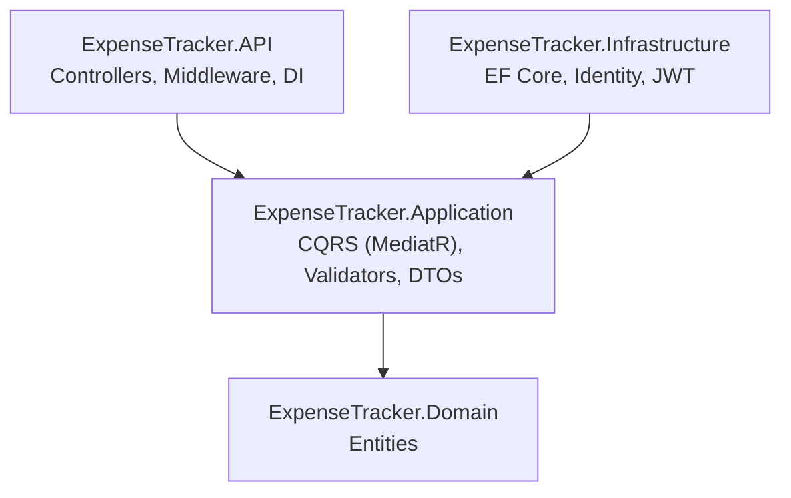

# Expense Tracker

A full-stack personal finance management application built with **.NET 10** and **Angular 21**, following **Clean Architecture** principles and **CQRS** pattern.

[](https://dotnet.microsoft.com/)
[](https://angular.dev/)
[](https://www.postgresql.org/)
[](https://www.docker.com/)
[]()
[]()

> ⚠️ This is a personal learning/portfolio project, currently under active development. Not intended for production use. Backend and frontend implementation are complete — testing phase in progress on both layers.

---

## Architecture Overview

The backend follows **Clean Architecture**, with dependencies flowing in a single direction toward the core:



`ExpenseTracker.API` exposes REST controllers and depends only on `Application`, which holds the use cases — implemented as CQRS commands and queries via MediatR — and defines the repository interfaces without knowing how they're implemented. `ExpenseTracker.Infrastructure` implements those interfaces (EF Core, PostgreSQL, ASP.NET Core Identity, JWT/refresh token handling, MailKit) and depends on `Application`, never the other way around. `ExpenseTracker.Domain` sits at the core with zero external dependencies — just entities and business rules.

---

## Tech Stack

### Backend
| Technology | Purpose |
|---|---|
| .NET 10 | Runtime |
| ASP.NET Core Web API | REST API |
| Entity Framework Core 9 | ORM |
| PostgreSQL 16 | Database |
| ASP.NET Core Identity | User management, password reset tokens |
| MediatR | CQRS pattern |
| FluentValidation | Input validation |
| ErrorOr | Result pattern |
| JWT + Refresh Token | Authentication |
| MailKit | Transactional email (password reset) |

### Frontend
| Technology | Purpose |
|---|---|
| Angular 21 | SPA Framework |
| Angular Material | UI Components |
| TailwindCSS | Styling |
| Chart.js + ng2-charts | Charts and reports visualization |
| ngx-skeleton-loader | Loading skeletons |
| ngx-toastr | Toast notifications (success/error/loading) |

### Infrastructure
| Technology | Purpose |
|---|---|
| Docker + Docker Compose | Containerization |
| VS Code Dev Containers | Development environment |
| Adminer | Database GUI |
| Mailpit | Local SMTP catcher for email testing |

### Testing
| Technology | Purpose |
|---|---|
| xUnit v3 | Backend test framework |
| NSubstitute | Backend mocking |
| FluentAssertions | Backend assertions |
| FluentValidation.TestHelper | Backend validator testing |
| Jest | Frontend test framework |
| Angular Testing Library / TestBed | Frontend component testing |

---

## Features

### Authentication
- Register and login with JWT access token
- Refresh token delivered via httpOnly, Secure cookie — never exposed to client-side JavaScript
- Refresh token rotation with SHA-256 hashing and reuse detection
- CSRF protection via double-submit cookie pattern (antiforgery token)
- Token revocation (logout)
- Password recovery via emailed reset link, using a dedicated ASP.NET Identity token provider (1-hour expiry, single use). Rate-limited and designed to never reveal whether an email is registered (anti-enumeration)
- NIST-compliant password policy
- Account lockout after failed attempts

### Categories
- Create, read, update, delete personal expense categories
- Categories are scoped per user
- Deletion blocked if associated expenses exist

### Expenses
- Full CRUD for personal expenses
- Each expense linked to a category
- Dates stored as `DateOnly` for precision

### Reports
- Expense summary by category and by month
- Grand total calculation over a date range

---

## Getting Started

### Prerequisites
- [Docker Desktop](https://www.docker.com/products/docker-desktop/)
- [VS Code](https://code.visualstudio.com/) with the [Dev Containers](https://marketplace.visualstudio.com/items?itemName=ms-vscode-remote.remote-containers) extension

### Setup

1. Clone the repository:
```bash
git clone git@github.com:Giacomo001/expense-tracker.git
cd expense-tracker
```

2. Create the environment files:

**.env**
```env
POSTGRES_USER=your_postgres_user
POSTGRES_PASSWORD=your_postgres_password
POSTGRES_DB=your_postgres_db
```

**.env.container**
```env
ConnectionStrings__DefaultConnection=Host=db;Port=5432;Database=YOUR_DB;Username=YOUR_USERNAME;Password=YOUR_PASSWORD

Jwt__Key=YOUR_SECRET_KEY_MIN_32_CHARS
Jwt__Issuer=ExpenseTrackerAPI
Jwt__Audience=ExpenseTrackerClient
Jwt__ExpiresInMinutes=60
Jwt__RefreshTokenExpirationDays=7

Frontend__BaseUrl=http://localhost:4200

# Local email testing via Mailpit (no real credentials needed, see step 4 below)
Email__Host=mailpit
Email__Port=1025
Email__Username=
Email__Password=
Email__FromEmail=noreply@expensetracker.local
Email__FromName=Expense Tracker
Email__UseSsl=false
```

3. Open the project in VS Code and select **Reopen in Container** when prompted.

4. Mailpit (local SMTP catcher) starts automatically with Docker Compose. Password reset emails are captured there instead of being sent for real — view them at `http://localhost:8025`.

5. Run the database migrations:
```bash
make migrate name=InitialCreate
make update
```

6. Start the API:
```bash
dotnet run --project ExpenseTracker.API
```

7. Start the frontend (in a separate terminal, inside the container):
```bash
cd client
npm install --legacy-peer-deps
ng serve --host 0.0.0.0
```

> `--legacy-peer-deps` is required due to a peer dependency mismatch — see [Known Issues](#known-issues).

The API will be available at `http://localhost:8080`, the frontend at `http://localhost:4200`, Adminer (DB GUI) at `http://localhost:8081`, and Mailpit (email catcher) at `http://localhost:8025`.

---

## Running Tests

### Backend
```bash
dotnet test
```

### Frontend
```bash
cd client
npm test
```

---

## Project Structure

The solution is split by Clean Architecture layer:
- `ExpenseTracker.API` holds Controllers, Middleware and dependency injection setup — it's the only project that talks HTTP.
- `ExpenseTracker.Application` groups CQRS Features (Commands and Queries), DTOs, Validators, Mappers and the repository Interfaces the layer depends on.
- `ExpenseTracker.Domain` contains just the core Entities.
- `ExpenseTracker.Infrastructure` implements everything Application declares: Persistence (EF Core), Identity, and external Services (email, JWT).
- `client` holds the Angular frontend, complete and responsive across devices.
- `Tests` mirrors this split with Features, Validators and Mappers test suites.
- `.devcontainer` at the root configures the VS Code development environment.

---

## Security Highlights

- Passwords require minimum 12 characters with uppercase, lowercase, digit, and special character.
- Account lockout after 5 failed attempts for 15 minutes.
- Refresh token stored in an HttpOnly, Secure cookie scoped to /api/auth — never accessible to client-side JavaScript, and stored server-side as a SHA-256 hash.
- Refresh token reuse detection: replaying an already-used token revokes all active tokens for that user.
- CSRF protection on refresh/revoke endpoints via double-submit cookie (XSRF-TOKEN / X-XSRF-TOKEN).
- JWT ClockSkew set to zero for strict expiration enforcement.
- User data fully isolated — repository queries always filter by UserId.
- Password reset tokens are stateless (ASP.NET Identity `DataProtector`), 1-hour lifespan, single use, and automatically invalidated if the account's password changes in the meantime.
- Password reset flow never reveals whether an email address is registered (identical response and identical error messages for existing and non-existing accounts).
- Rate limiting on authentication endpoints (login, register, forgot-password), partitioned by client IP.

---

## Known Issues

- Frontend dependencies require `npm install --legacy-peer-deps`: `@angular-builders/jest@21.0.4` still declares a peer dependency on the renamed `@angular-devkit/build-angular` package instead of `@angular/build`. A fix requires bumping to `@angular-builders/jest@22.x`, which targets Angular 22 — out of scope for this Angular 21.2 project.
- `npm audit` reports a handful of moderate-severity vulnerabilities in the Jest/webpack-dev-server toolchain (transitive `uuid` dependency via the same package above). Dev-only tooling, not shipped to the production bundle.

---

## Roadmap

- [x] Backend — Clean Architecture + CQRS
- [x] Authentication with JWT + Refresh Token
- [x] Password recovery flow (forgot/reset password)
- [x] Backend Unit Tests
- [x] Frontend — Angular
- [x] Frontend Unit Tests
- [ ] Integration Tests

---

## License

Proprietary software. All rights reserved. Copying, distribution, or modification without explicit authorization from the repository owner is prohibited.
