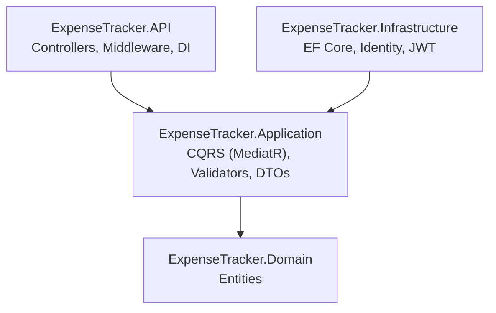

# Expense Tracker

A full-stack personal finance management application built with **.NET 10** and **Angular 20**, following **Clean Architecture** principles and **CQRS** pattern.

[](https://dotnet.microsoft.com/)
[](https://angular.dev/)
[](https://www.postgresql.org/)
[](https://www.docker.com/)
[]()

> ⚠️ This project is currently under active development. Frontend is in progress.

---

## Architecture Overview

The backend follows **Clean Architecture**, with dependencies flowing in a single direction toward the core:



`ExpenseTracker.API` exposes REST controllers and depends only on `Application`, which holds the use cases — implemented as CQRS commands and queries via MediatR — and defines the repository interfaces without knowing how they're implemented. `ExpenseTracker.Infrastructure` implements those interfaces (EF Core, PostgreSQL, ASP.NET Core Identity, JWT/refresh token handling) and depends on `Application`, never the other way around. `ExpenseTracker.Domain` sits at the core with zero external dependencies — just entities and business rules.

---

## Tech Stack

### Backend
| Technology | Purpose |
|---|---|
| .NET 10 | Runtime |
| ASP.NET Core Web API | REST API |
| Entity Framework Core 9 | ORM |
| PostgreSQL 16 | Database |
| ASP.NET Core Identity | User management |
| MediatR | CQRS pattern |
| FluentValidation | Input validation |
| ErrorOr | Result pattern |
| JWT + Refresh Token | Authentication |

### Frontend
| Technology | Purpose |
|---|---|
| Angular 20 | SPA Framework |
| Angular Material | UI Components |
| TailwindCSS | Styling |

### Infrastructure
| Technology | Purpose |
|---|---|
| Docker + Docker Compose | Containerization |
| VS Code Dev Containers | Development environment |

### Testing
| Technology | Purpose |
|---|---|
| xUnit v3 | Test framework |
| NSubstitute | Mocking |
| FluentAssertions | Assertions |

---

## Features

### Authentication
- Register and login with JWT access token
- Refresh token rotation with SHA-256 hashing
- Token revocation (logout)
- NIST-compliant password policy
- Account lockout after failed attempts

### Categories
- Create, read, update, delete personal expense categories
- Categories are scoped per user
- Deletion blocked if associated expenses exist

### Expenses
- Full CRUD for personal expenses
- Each expense linked to a category
- Dates stored as `DateOnly` for precision

### Reports
- Expense summary by category and by month
- Grand total calculation over a date range

---

## Getting Started

### Prerequisites
- [Docker Desktop](https://www.docker.com/products/docker-desktop/)
- [VS Code](https://code.visualstudio.com/) with the [Dev Containers](https://marketplace.visualstudio.com/items?itemName=ms-vscode-remote.remote-containers) extension

### Setup

1. Clone the repository:
```bash
git clone git@github.com:Giacomo001/expense-tracker.git
cd expense-tracker
```

2. Create the environment files:

**.env**
```env
POSTGRES_USER=your_postgres_user
POSTGRES_PASSWORD=your_postgres_password
POSTGRES_DB=your_postgres_db
```

**.env.container**
```env
ConnectionStrings__DefaultConnection=Host=db;Port=5432;Database=YOUR_DB;Username=YOUR_USERNAME;Password=YOUR_PASSWORD
Jwt__Key=YOUR_SECRET_KEY_MIN_32_CHARS
Jwt__Issuer=ExpenseTrackerAPI
Jwt__Audience=ExpenseTrackerClient
Jwt__ExpiresInMinutes=60
Jwt__RefreshTokenExpirationDays=7
```

3. Open the project in VS Code and select **Reopen in Container** when prompted.

4. Run the database migrations:
```bash
make migrate name=InitialCreate
make update
```

5. Start the API:
```bash
dotnet run --project ExpenseTracker.API
```

The API will be available at `http://localhost:8080`.

---

## Running Tests

```bash
dotnet test
```

Current coverage: **27 unit tests** across Commands, Queries, and Report aggregations.

---

## Project Structure

The solution is split by Clean Architecture layer. `ExpenseTracker.API` holds Controllers, Middleware and dependency injection setup — it's the only project that talks HTTP. `ExpenseTracker.Application` groups CQRS Features (Commands and Queries), DTOs, Validators, Mappers and the repository Interfaces the layer depends on. `ExpenseTracker.Domain` contains just the core Entities. `ExpenseTracker.Infrastructure` implements everything Application declares: Persistence (EF Core), Identity and external Services. `Tests` mirrors this split with Features, Validators and Mappers test suites, and `client` holds the Angular frontend, still in progress. `.devcontainer` at the root configures the VS Code development environment.

---

## Security Highlights

- Passwords require minimum 12 characters with uppercase, lowercase, digit, and special character
- Account lockout after 5 failed attempts for 15 minutes
- Refresh tokens stored as SHA-256 hashes — plain tokens never persisted
- JWT `ClockSkew` set to zero for strict expiration enforcement
- User data fully isolated — repository queries always filter by `UserId`

---

## Roadmap

- [x] Backend — Clean Architecture + CQRS
- [x] Authentication with JWT + Refresh Token
- [x] Unit Tests
- [x] Frontend — Angular
- [x] Filtering and pagination on Expenses
- [ ] Integration Tests

---

## License

Proprietary software. All rights reserved. Copying, distribution, or modification without explicit authorization from the repository owner is prohibited.
